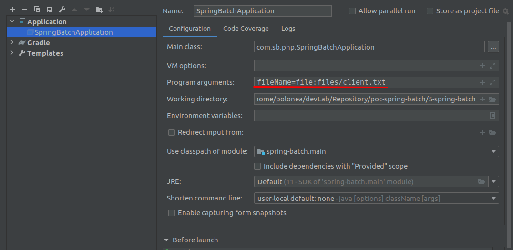

# poc-spring-batch
Leitura de arquivo de largura fixa

fileName=file:files/client.txt

### Metadados

    docker-compose up -d
    docker-compose stop

##### Acesso a inteface SGBD
Após subir o container podemos acessar o SGBD pelo link a seguir.

[Acessar phpMyAdmin](http://localhost/)

    Server: server-sb-poc-03
    User: root
    Password: root
