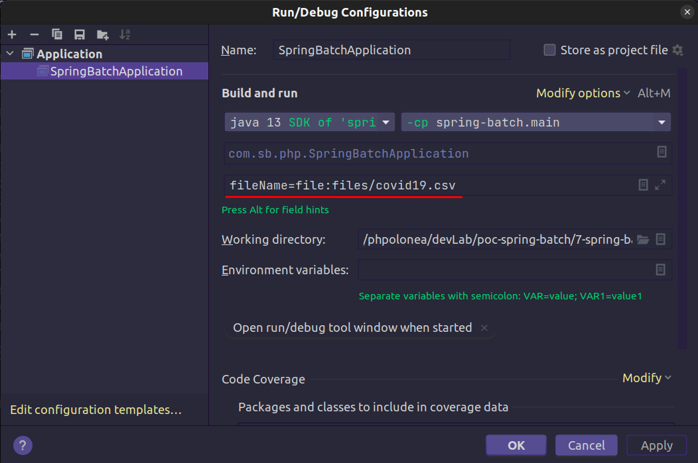

# poc-spring-batch
Esta app lê um arquivo csv e grava em no banco de dados

fileName=file:files/covid19.csv

### Metadados

    docker-compose up -d
    docker-compose stop

##### Acesso a inteface SGBD
Após subir o container podemos acessar o SGBD pelo link a seguir.

[Acessar phpMyAdmin](http://localhost:8081/)

    Server: server-sb-poc-07
    User: root
    Password: root
    db: sb-poc-07

--

    Server: server-sb-poc-07
    User: adm
    Password: root
    db: appxpto