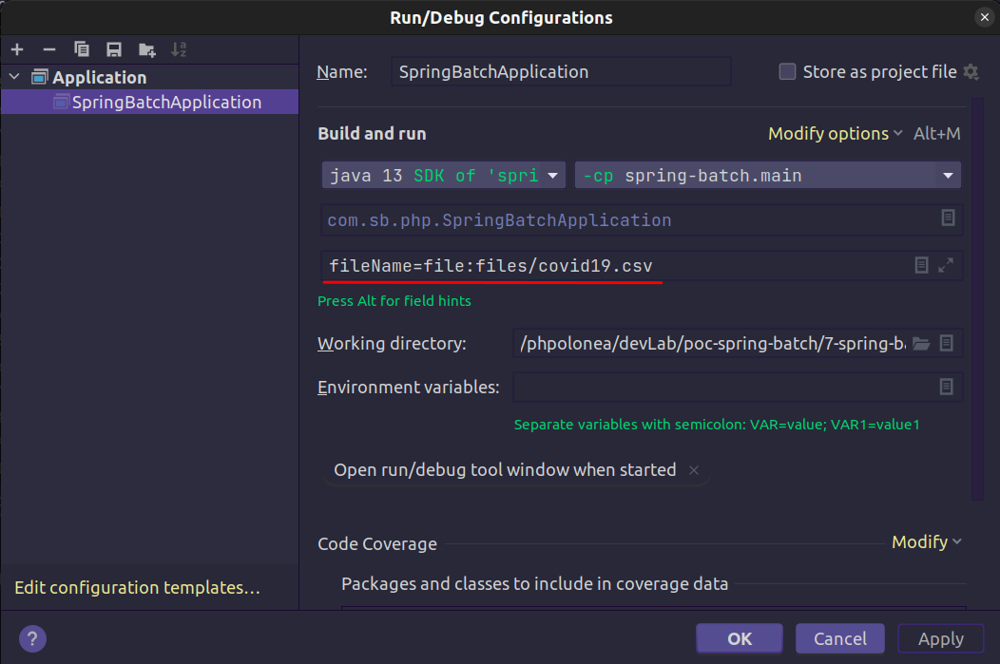

# poc-spring-batch
Leitura de arquivo delimitado 

fileName=file:files/covid19.csv

### Metadados

    docker-compose up -d
    docker-compose stop

##### Acesso a inteface SGBD
Após subir o container podemos acessar o SGBD pelo link a seguir.

[Acessar phpMyAdmin](http://localhost:8081/)

      Server: server-sb-poc-08
        User: root
    Password: root
          db: sb-poc-08

--

      Server: server-sb-poc-08
        User: adm
    Password: root
          db: appxpto

##### Acesso a inteface RabbitMq
[Acessar RabbitMq](http://localhost:15672/)
    
        User: guest
    Password: guest